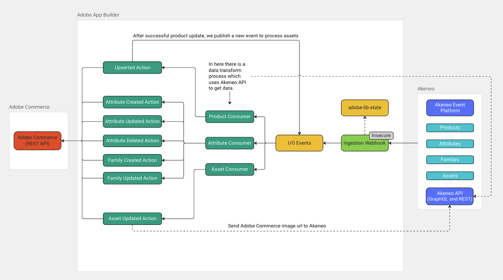
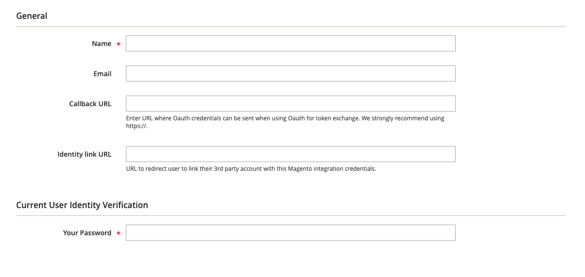

# Akeneo Integration with Adobe App Builder
This project leverages Adobe App Builder to integrate Akeneo with Adobe Commerce. It utilizes the Akeneo Event Platform and Adobe I/O Events to enable event-based synchronization between the two systems.

This is a reference integration that supports the synchronization of products, attributes, families, and assets. It also includes onboarding scripts and a standardized architecture for developers to build upon, adhering to best practices.

## Features:


Families:
- Create and update families from Akeneo as attribute sets in Adobe Commerce.

Attributes:
- Create, update, and delete text attributes from Akeneo in Adobe Commerce.

Products:
- Create or update products based on the family they are assigned to.
- Skip product synchronization if the product family is not whitelisted in .env.
- Support for multistore.

Assets:
- Send assets to Adobe Commerce.
- Attach assets to products.
- Save the image URL generated in Adobe Commerce back to the asset in Akeneo.


## Prerequisites

### Create App Builder project
Go to the [Adobe developer console](https://developer.adobe.com/console) portal
- Click on `Create a new project from template`
- Select `App Builder`
- Chose a name and title
- Select stage workspace or create a new one
- Add the following API services (select default Oauth server to server)
  - I/0 events
  - Adobe I/O Events for Adobe Commerce
  - I/O management API
- Download the [workspace configuration JSON](https://developer.adobe.com/commerce/extensibility/events/project-setup/#download-the-workspace-configuration-file) file and save it as `workspace.json` in the `./scripts/onboarding/config` starter kit folder because you will use it to configure Adobe IO Events in commerce afterward.

### Configure a new Integration in commerce
Configure a new Integration to secure the calls to Commerce from App Builder using OAuth by following these steps:
- In the Commerce Admin, navigate to System > Extensions > Integrations.
- Click the `Add New Integration` button. The following screen displays
  
- Give the integration a name. The rest of the fields can be left blank.
- Select API on the left and grant access to all the resources.
  
- Click Save.
- In the list of integrations, activate your integration.
- To configure the starter kit, you will need the integration details (consumer key, consumer secret, access token, and access token secret).

### Install Commerce Eventing module (only required when running Adobe Commerce versions 2.4.4 or 2.4.5) 
Install Adobe I/O Events for Adobe Commerce module in your commerce instance following this [documentation](https://developer.adobe.com/commerce/extensibility/events/installation/)

> **Note**
> 
> By upgrading the Adobe I/O Events for Adobe Commerce module to version 1.6.0 or greater, you will benefit from some additional automated steps during onboarding.  

## Starter Kit first deploy & onboarding
Following the next steps, you will deploy and onboard the starter kit for the first time. The onboarding process sets up event providers and registrations based on your selection.

### Download the project
- Download and unzip the project
- Copy the env file `cp env.dist .env`
- Fill in the values following the comments on the env file.

### Configure the project
Install the npm dependencies using the command:
```bash
npm install
```

This step will connect your starter kit project to the App builder project you created earlier.
Ensure to select the proper Organization > Project > Workspace with the following commands:
```bash
aio login
aio console org select
aio console project select
aio console workspace select
```

Sync your local application with the App Builder project using the following command:
```bash
aio app use
# Choose the option 'm' (merge) 
```

### Deploy
Run the following command to deploy the project; this will deploy the runtime actions needed for the onboarding step:
```bash
aio app deploy
```
### Onboarding
This step will generate the IO Events providers and the registrations for your starter kit project.
If your Commerce instance Adobe I/O Events for Adobe Commerce module version 1.6.0 or greater, the module will also be automatically configured by the onboarding script.  
To start the process run the command:
```bash
npm run onboard
npm run akeneo-event-subscribe
```
